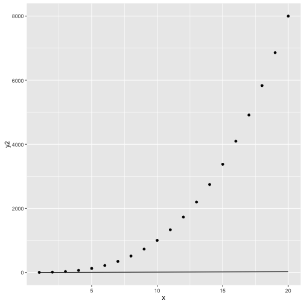
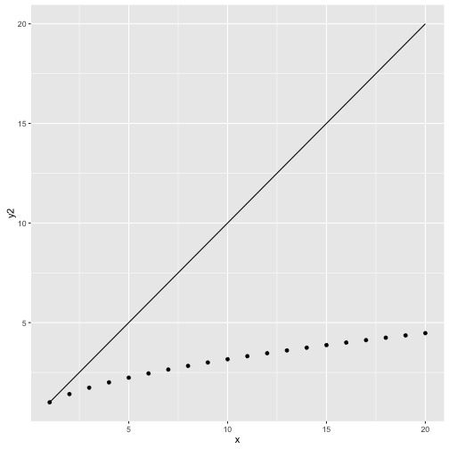
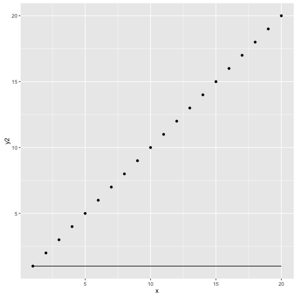

Shiny App:
Comparing Exponentials
========================================================
author: B.Hubler
date: 12/23/2015


1. About the App
========================================================

Features of the Application

- Slider for changing exponential
- Input Box to set static exponential
- Results are plotted and displayed

2. Plot Information
========================================================
### For the plot, x is considered to be 1:20:

```
 [1]  1  2  3  4  5  6  7  8  9 10 11 12 13 14 15 16 17 18 19 20
```
### y = x^m
### where m = slider input OR static input
### Examples...

3. Example 1
========================================================

 

## Static line (solid) is equal to x^1
## Changing line (dotted) is equal to x^3

4. Example 2
========================================================

 

## Static line (solid) is equal to x^1
## Changing line (dotted) is equal to x^0.5

5. Try it Out
========================================================

## Can you predict what the exponents are in the line below? 

 

6. Conclusion
========================================================

- The app illustrates the affect of exponent on the slope of the line.
- Try for yourself!


**Answer from previous slide: solid line m = 0, dotted line m = 1**

